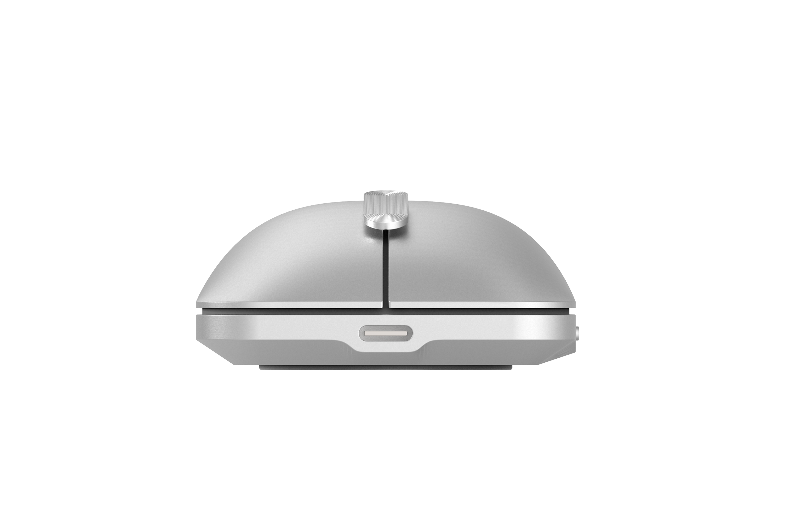

    <h1 class="project-title">
        Axis
    </h1>
    

       This is a self initiated project which explores the way that we interact with a computer mouse. 
         
       How many times does the average person click on their computer mouse a day? How many pixels do they move across their screen? How far do they scroll? Our computer mice get used a hell of a lot. Acknowledging this, I couldn't help but recognize a huge opportunity for impact. If you can make any type of small incremental improvement to a computer mouse, it would equal a huge amount of value over it's lifetime of use.
    

    

       The defining feature of this concept is the way the mouse scrolls. Instead of a scroll wheel it uses a scroll joystick, only one thats restricted to one plane of movement flinging back into it's central position after use. This approach means that to scroll long distances on screen the user doesn't need to flick the scroll wheel continuously, but can instead keep their finger holding forwards until they reach the point in the page they want ... at which point they can simply let go. 
    

    

        I wanted to try my hand at designing some packaging to complete the project, leveraging a simple illustration style to give a glimpse at the product before opening in it's exact dimensions orthographically representing the different sides of the product around the box itself.
    

