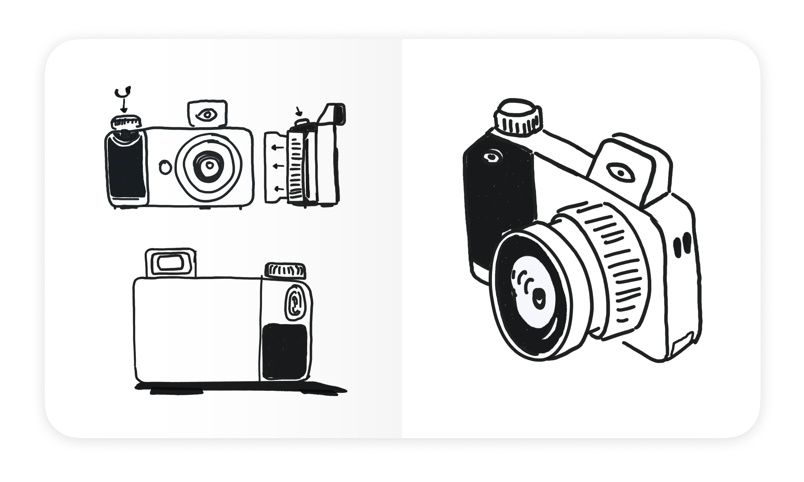
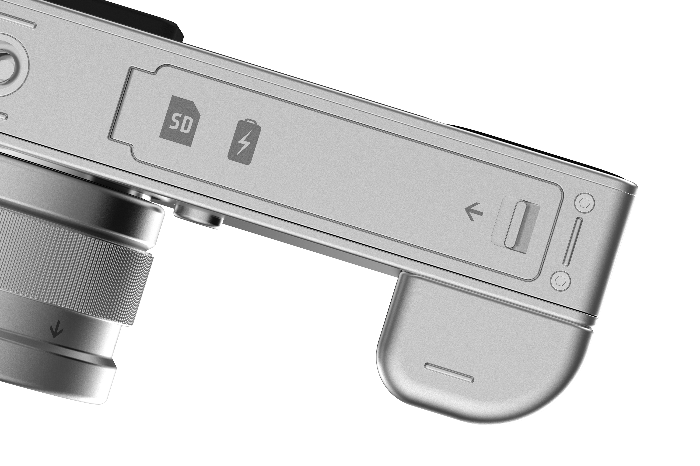
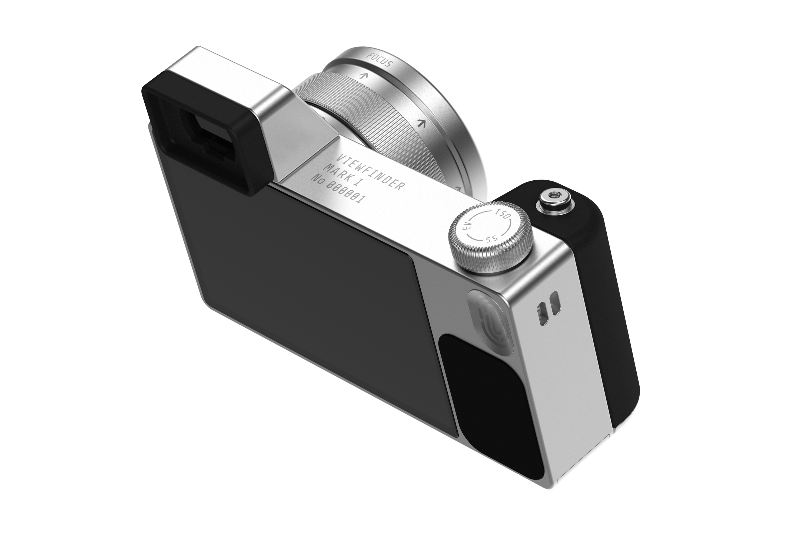
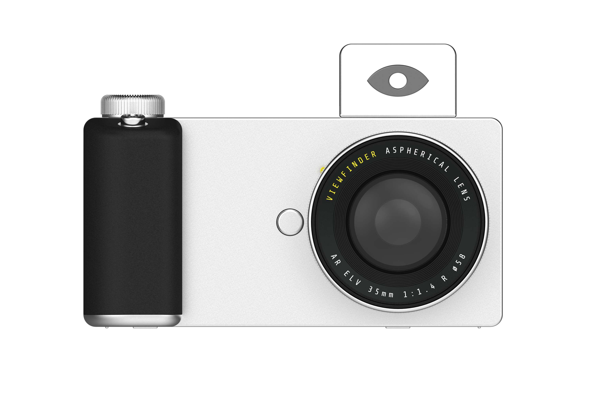
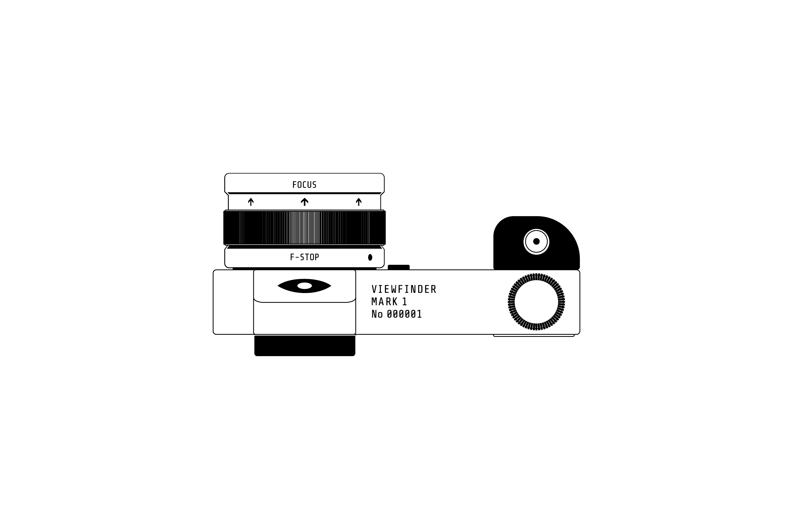
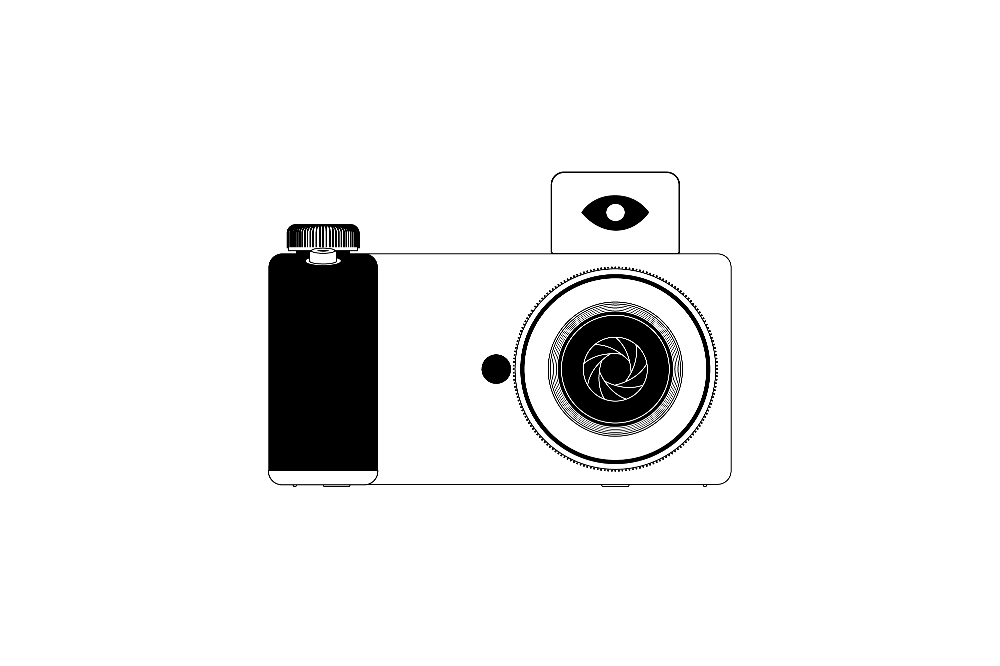
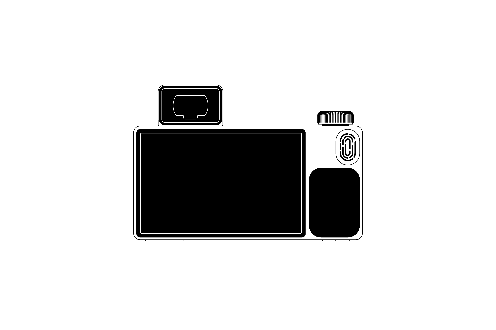
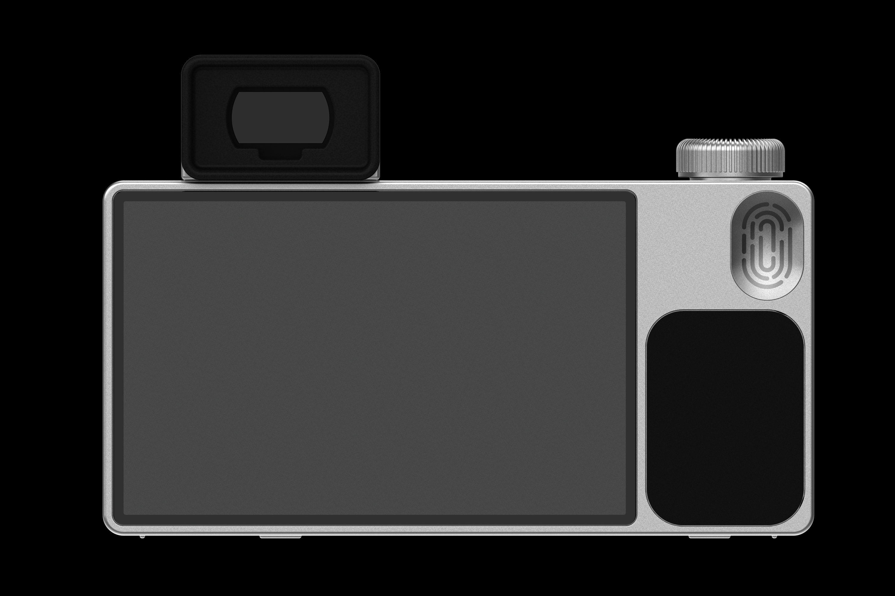
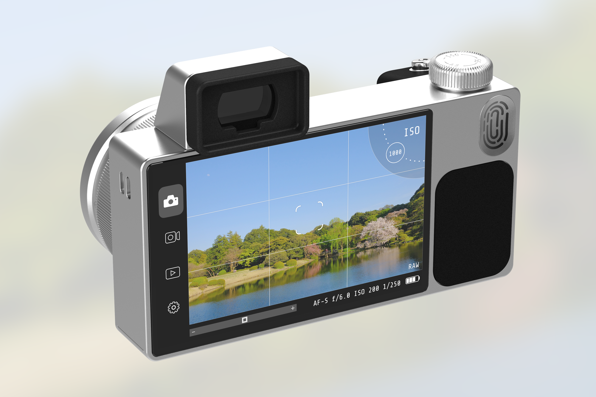
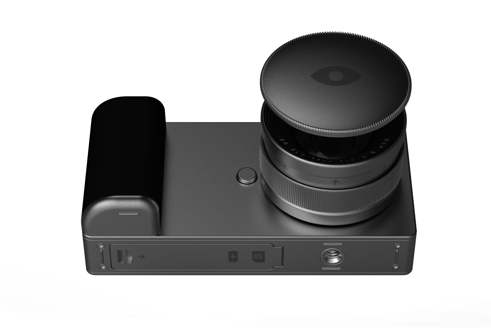

    

        Breaking
    

    

        The goal of this project is to create a camera concept where the hardware and software are designed holistically. There are a couple of problems with most cameras out there today that I wanted to focus on. How might we ease the learning curve required for many proffessional-grade cameras today? How might we give people more ownership of the images that they take? How might we create a more succinct overlap in the way that hardware and software in cameras interact today? These are all questions that I aimed to address in this project. 
    

    

        Dialing in the details
    

    

        One of the unique things about this camera is it's control dial. Cameras today have multiple dials for seperate functions, like for controlling the ISO, or Shutter Speed, or the Exposure compensation values. The problem with this approach is as you're taking a photo you need to be constantly playing with each of these dials, requiring a user to remember locations while positioning a shot. Viewfinder takes a simpler approach, with one dial that can toggle between each of these functions with a push.
    

    

        The product package
    

    

        I tried to create a form that was clean and absolved of unnecessary elements. Using consistent values for radii, and central alignment of elements wherever possible. The large grip affords a confident grip. And markings around the camera communicate functionality while tie-ing in font's between the software and hardware. 
    

    

        Illustrations
    

    

        I illustrated the orthaganol views of the camera to help with menu systems within the systems UI, and also to be used to help communicate interactions with the dial and lens ring.
    

    

        UI
    

    

        With this project I took the oppertunity to envision how the UI and hardware could be seamlessly brought together to deliver a more holistic package.
    

<!--  -->

