

    

        A homage.
    

    

       Using illustrator, I've tried to distill each objects form down into a style that's bold, simple, and captures each object by their core visual elements. With objects ranging from Aesop handwash to the Porsche 911.
    

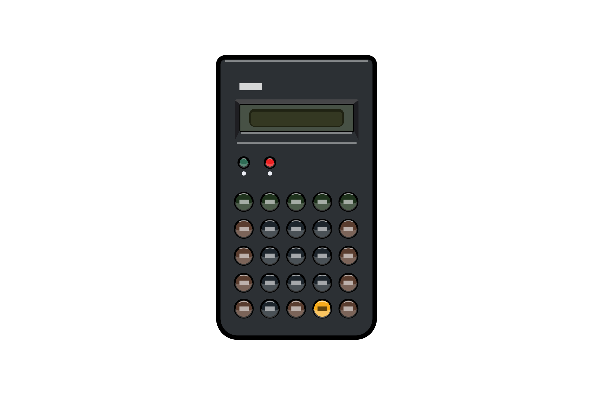

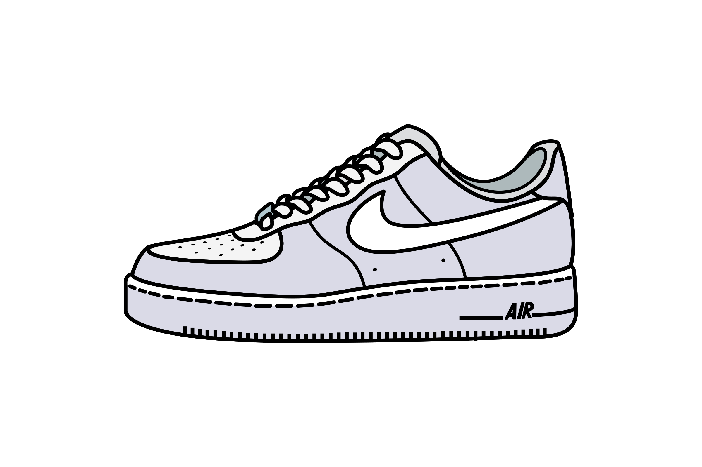

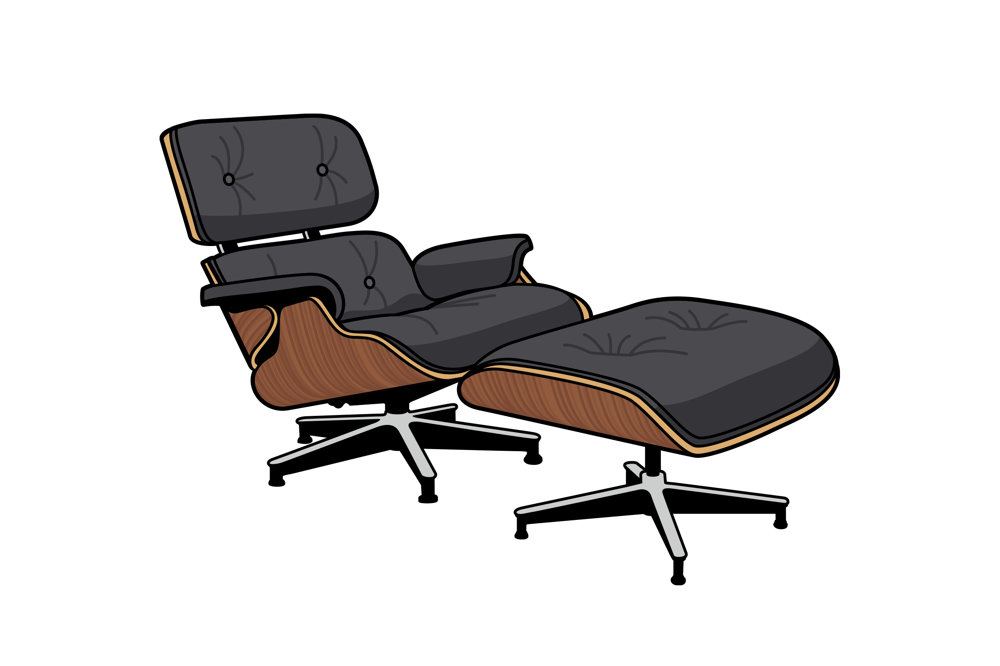

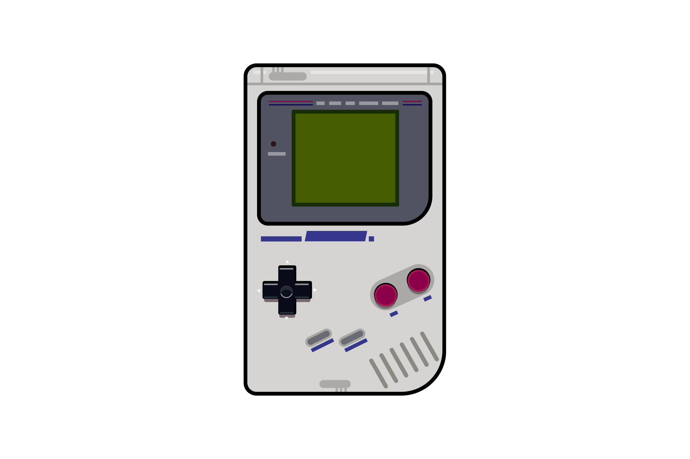

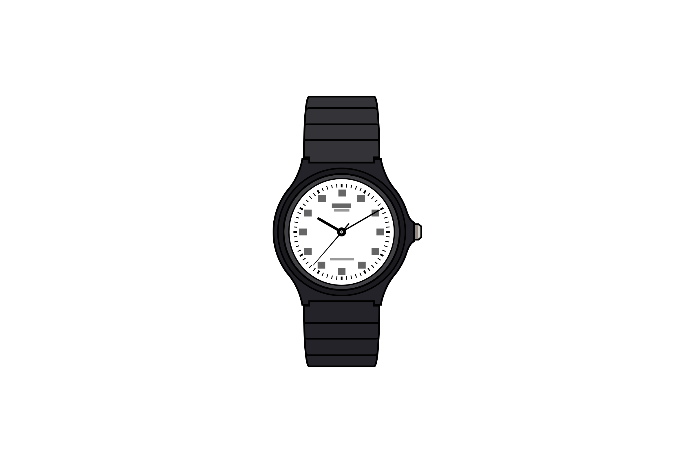

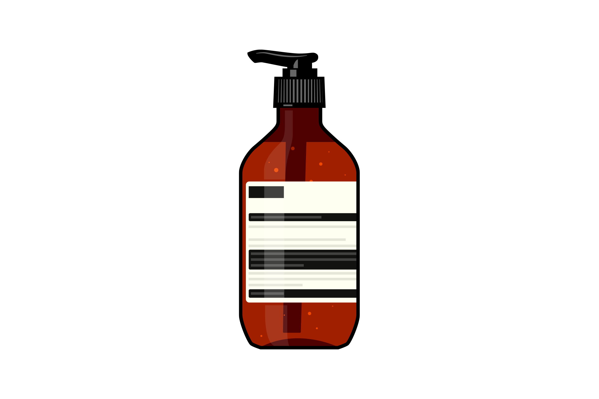

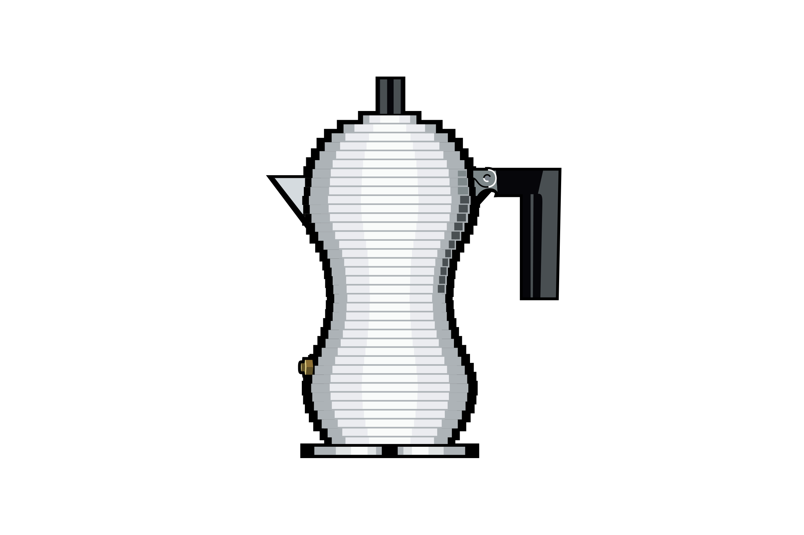

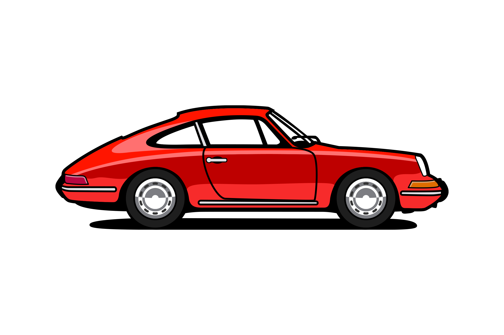

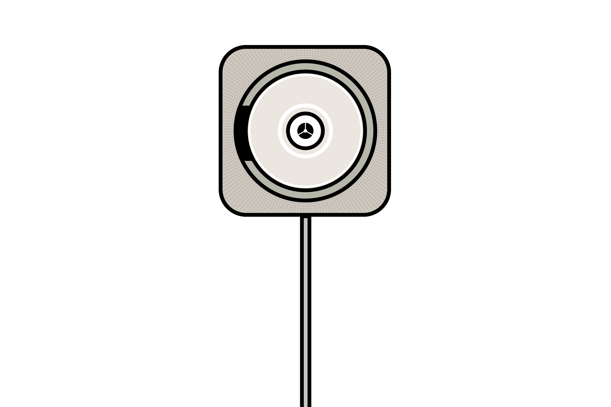

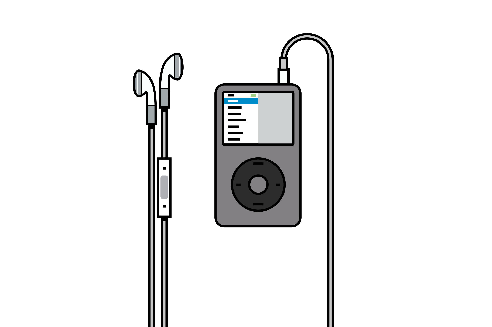

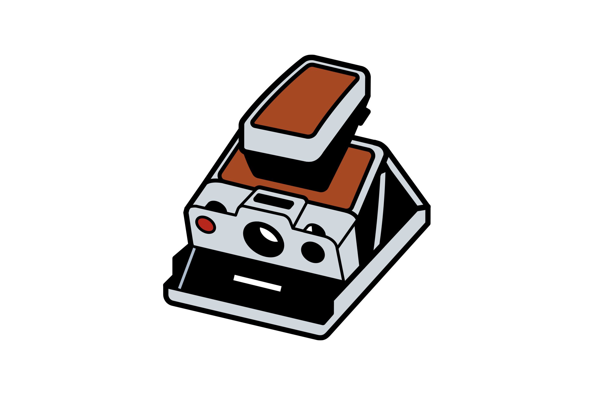

    

        Merch
    

    

       I auctioned off a calendar that included the icons for the Microsoft Give auction, which is a yearly event that raises money for charity. Stickers are also in the works. 
    

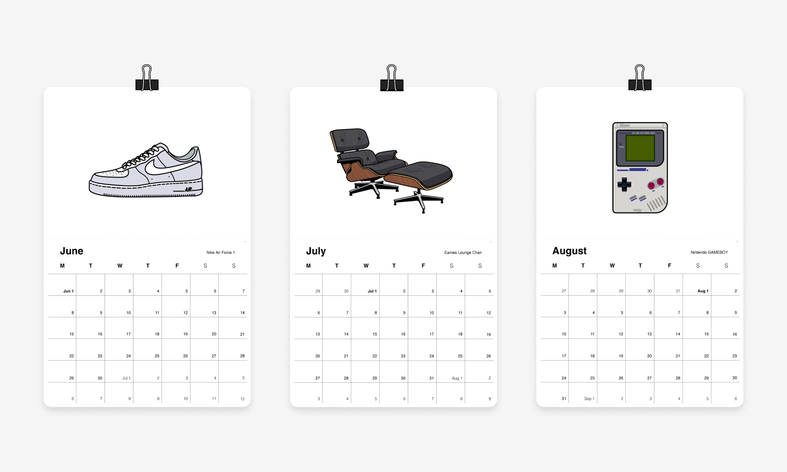

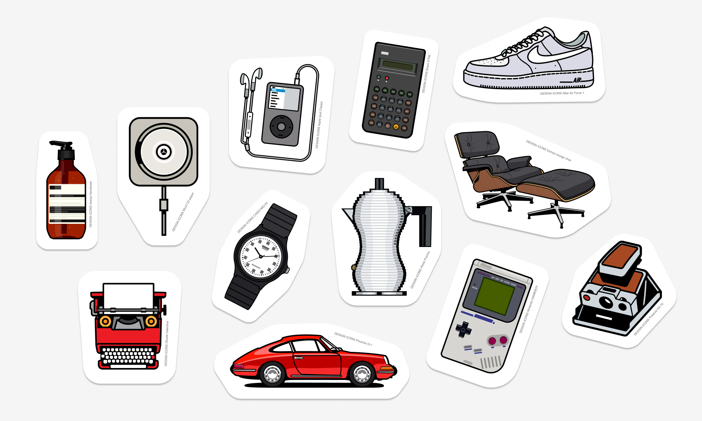

