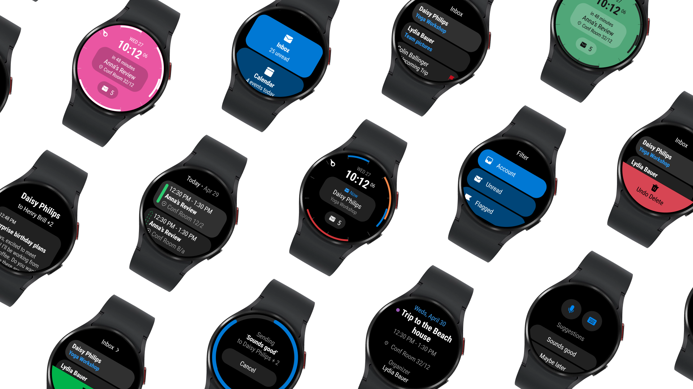
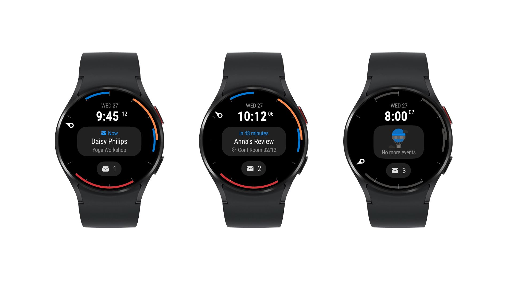

    <h1 class="project-title">
        Outlook Wear
    </h1>
    

        I was the designer on a complete redesign of the Outlook app on Google's Wear OS. I worked on the redesign while collaborating with contacts at Samsung to make sure that the experience excelled on their new Galaxy Watches, a result of a cross-company partnership with us at Microsoft. 
          
        From a bespoke Outlook watch face to the design of the main Mail and Calendar modules, I redesigned everything from the ground up with my awesome partners in PM and Dev. Notably Curtis, Mitali and Andy. This took a lot of design inspiration from the Apple Watch app
    

