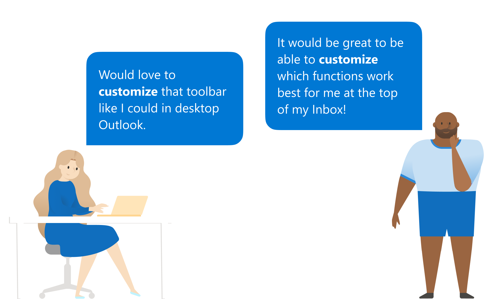
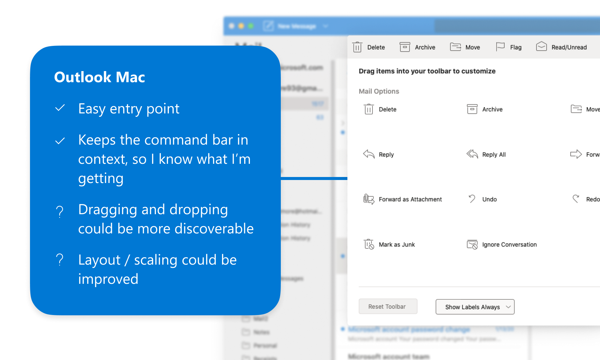
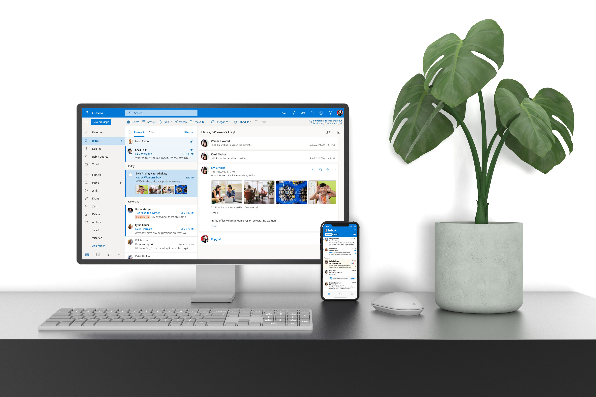
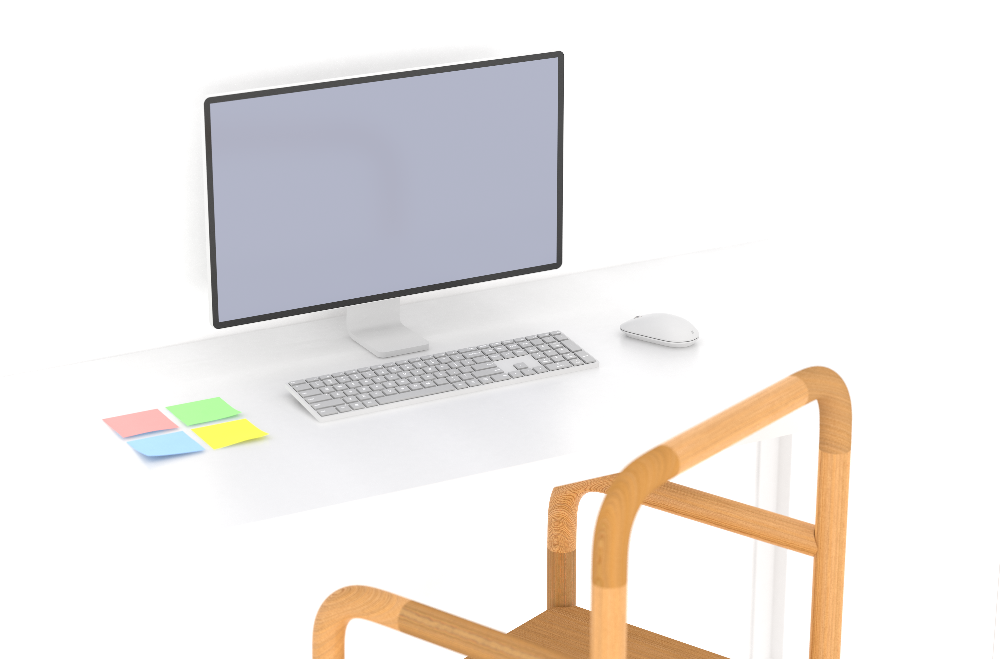

    

        Summary
    

    

        I'm currently a Senior Product Designer at Outlook (Microsofts email client), in a role focused on the Mac and Mobile apps. I've worked on a range of projects across it's ecosystem. It's taught me how to work effectively inside a large organization, one that involves a lot of moving parts. This page contains snapshots of some of the projects I've been thankful to be a part of.
    

    

        Toolbar customization on the web
           
    

    

        Following the footsteps of others. we already had a customization experience on two of our other clients: Desktop and Mac. Mac had the best experience of the two, but not without it's own problems. User feedback had given some points for improvement on the Outlook Mac model, points that we sought to address with the implementation on web. 
    

    

        Hack week rendering.
    

    

        For our hack week at microsoft, I wanted to spend some time learning more about rendering. I decided to spend a week creating models, and rendering out different scenes that could be used to surface different UI across our endpoints. The following images are the results of those experiments. The images are being used in future marketing explorations, and have been incorporated into the teams assets to use when presenting features. 
    

    

        Loading Animation
    

    

        After wanting to learn more about animation, I took it upon myself to explore how we might create a loading animation for Outlook. Motion has the amazing ability to change perception of time. With this, I was aiming to make the app feel more agile on boot. 
    

    

        Resizing Outlook on the web
    

    

        I was tasked with making Outlook responsive, down to a screen size of 320px. We came up with a prioritization framework for how content should be respected - what to keep on screen and what to hide at different stages when real estate becomes an issue. 
          
        It was the reverse of your normal process. Standard practice would have you start small and scale up; this was doing the opposite which came with a lot of complexities and fun challenges.
          
        Below is a recording of a prototype I coded using React and CSS media queries to define breakpoints and apply relevant layout changes. This prototype was essential in helping us land the final resize behaviour. 
    

