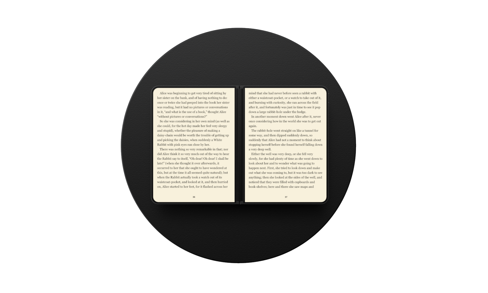
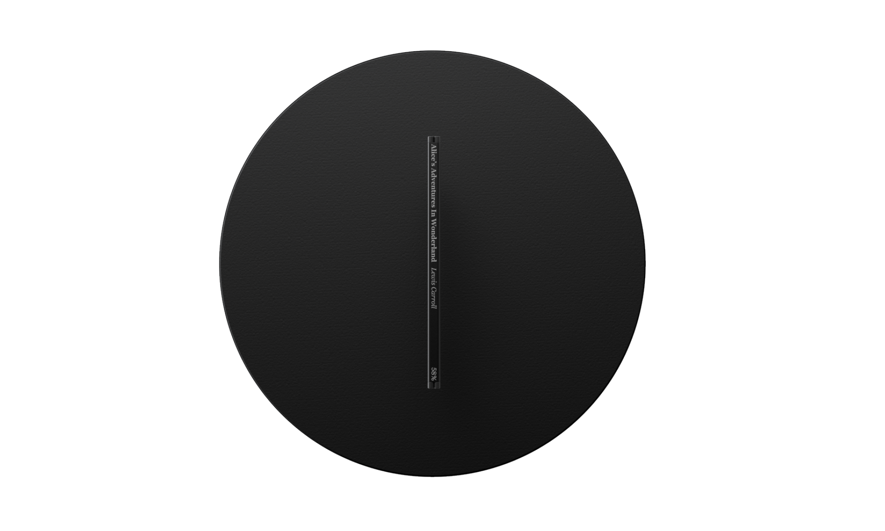
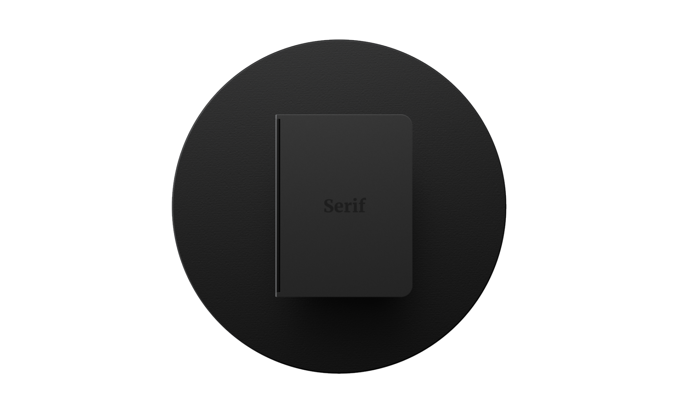
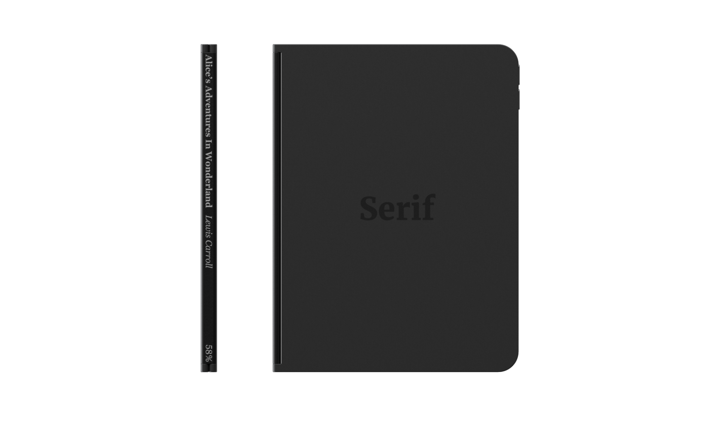
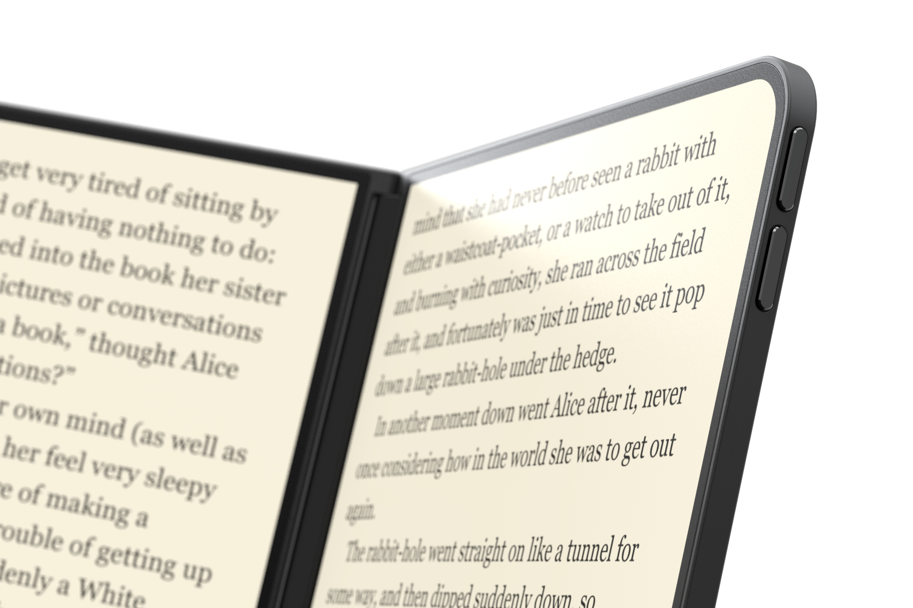

    

        E-Reader Concept
    

    

        I love my kindle, don't get me wrong. But what's next? E-Readers today have relatively incremental updates, and the form factor has been rarely challenged.
    

    

        Conception
    

    

        After talking ideas with a good friend (Telmen Dzjind - who happens to be an insane designer btw), we came up with the idea of a multi-screened e-reader.
    

    

        Approach.
    

    

        It's pretty easy to see the differences between a standard e-reader and a book today. The two key differences that I sought to address and improve were in the number of pages and also the lack of a spine. Those are the two defining features of this concept. 
    

