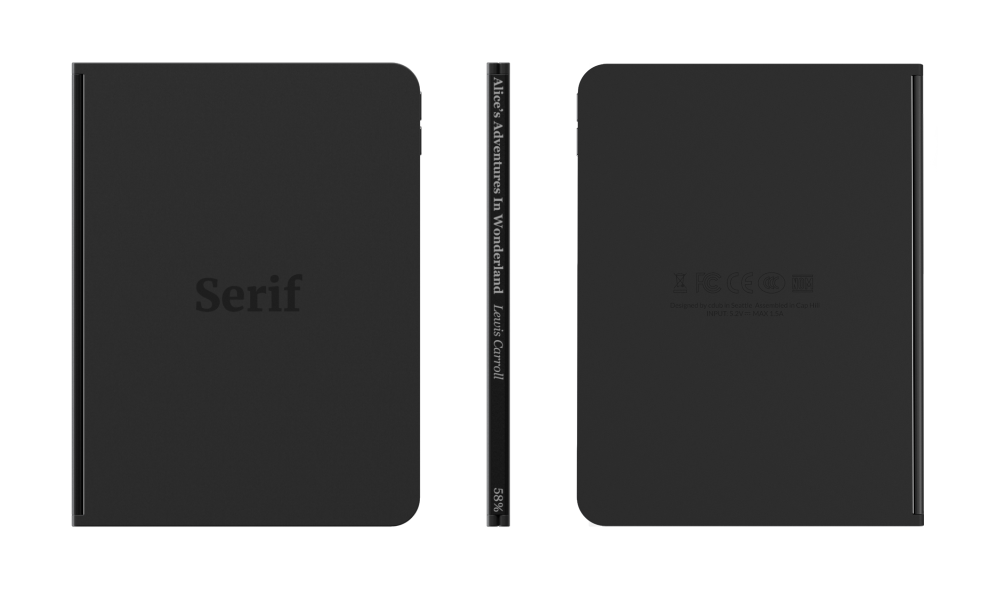

    <h1 class="project-title">
        Serif
    </h1>
    

        An e-reader with a spine that actually belongs on your bookshelf
          
        After chatting with a good friend over some drinks (Telmen Dzjind - who happens to be an amazing designer), we came up with the idea of a multi-screened e-reader. This project is an attempt to make that idea more tangible.
        Taking inspiration from the Microsoft Surface Duo and it's folding two screen approach - we couldn't help by feel the form would be a perfect match to help bridge the gap between ereaders today and the medium they attempt to replace.
          
        It's pretty easy to see the differences between a standard e-reader and a book today. The two key differences that I sought to address and improve were in the number of pages and also the lack of a spine. Those are the two defining features of this project. 
    

    

        The hinge of the e-reader shows the name of the current book that's being read through a slim e-ink display that updates dynamically with an indication of how far through the book the owner is. This tries to imitate the capabilities of current books, where you might have a book mark inside giving you some indication of progress.
    

    

        The display turns on as soon as the device is opened, which removes the need for a power or lock button. When the device is closed it's locked and when It's open it's unlocked.
    

    

        I took this as an opportunity to learn more about Keyshots capabilities to compose and render video. Below is a GIF which aims to demonstrate a little of the concepts form in a more robust way - highlighting different angles and postures of the device. It was interesting to play about with the position of lighting throughout the video - in attempt to catch different highlights around the model and and make it more dynamic. In retrospect it could have used a little more subtlety.
    

    

        Below is a figma prototype of Serif's UI, where you can interact with the device through your browser. This might be a little difficult on the phone because of real estate, so if possible it's best viewed through your computer.
    

<iframe style="border: 1px solid rgba(0, 0, 0, 0.1);" width="800" height="450" src="https://www.figma.com/embed?embed_host=share&url=https%3A%2F%2Fwww.figma.com%2Fproto%2F4oXYDhqPbNdsEIF2MCK6ec%2FUntitled%3Fpage-id%3D171%253A2%26node-id%3D173%253A0%26viewport%3D-170%252C750%252C0.13%26scaling%3Dcontain%26starting-point-node-id%3D173%253A0" allowfullscreen></iframe>
