

    <h1 class="project-title">
        Viewfinder
    </h1>
    

        This is a self initiated project. I enjoy photography as a hobby, and felt frustrated by the experience that I had with my personal camera (a Fujifilm XT-2). The UI was clunky, and the hardware had too many knobs and Dials. Overall I felt that there is an opportunity for a camera system which considers the hardware and software of the system in a more integrated approach.
          
        <!-- A lot of opportunity lies at the seams of hardware and software. I started this project because I believed that if a camera were to be designed across it's physical and digital make-up initially rather than software as an afterthought, then there could be a chance to better interweave them for a more seamless experience. 
        
 -->
        <!-- There are a couple of problems with most cameras out there today that I wanted to focus on. How might we ease the learning curve required for many proffessional-grade cameras today? How might we give people more ownership of the images that they take? How might we create a more succinct overlap in the way that hardware and software in cameras interact today? These are all questions that I aimed to address in this project.  -->

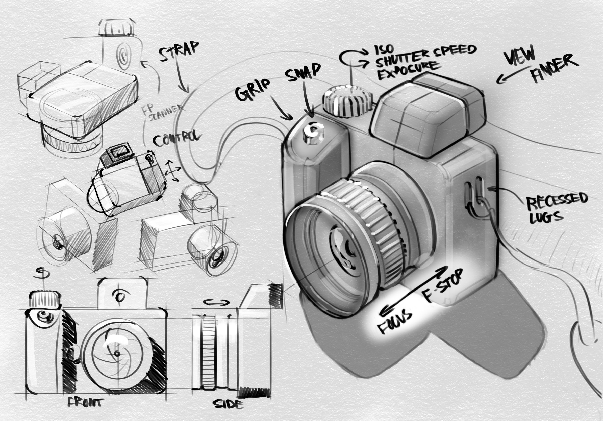

    

        For the hardware, I tried to create a form that was clean and absolved of unnecessary elements. Using consistent values for radii, and central alignment of elements wherever possible. The large grip affords a confident hold. And markings around the camera communicate functionality while tie-ing in font's between the software and hardware. 
    

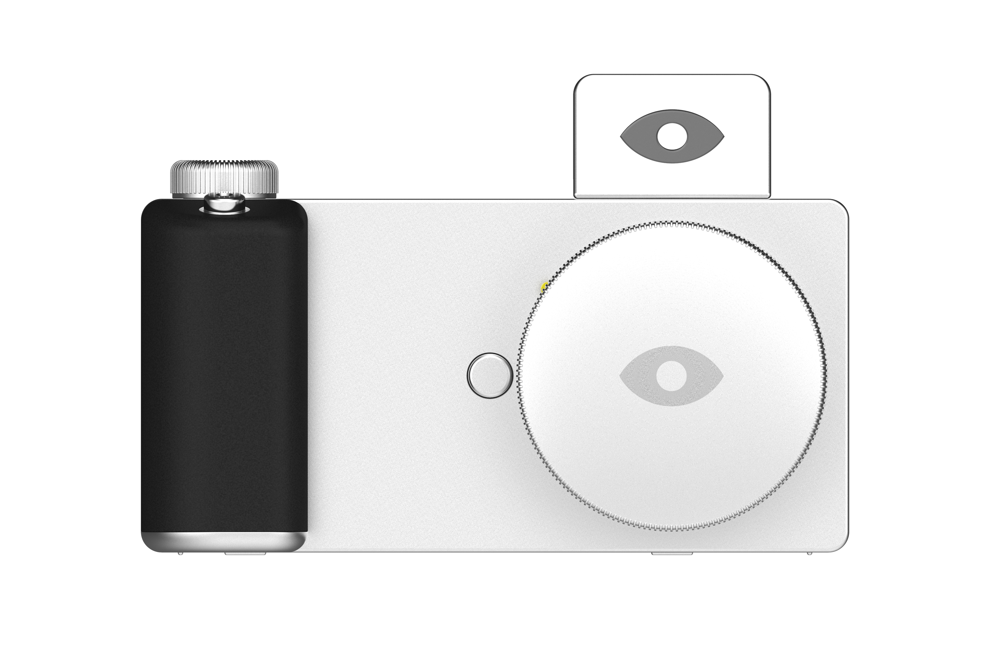

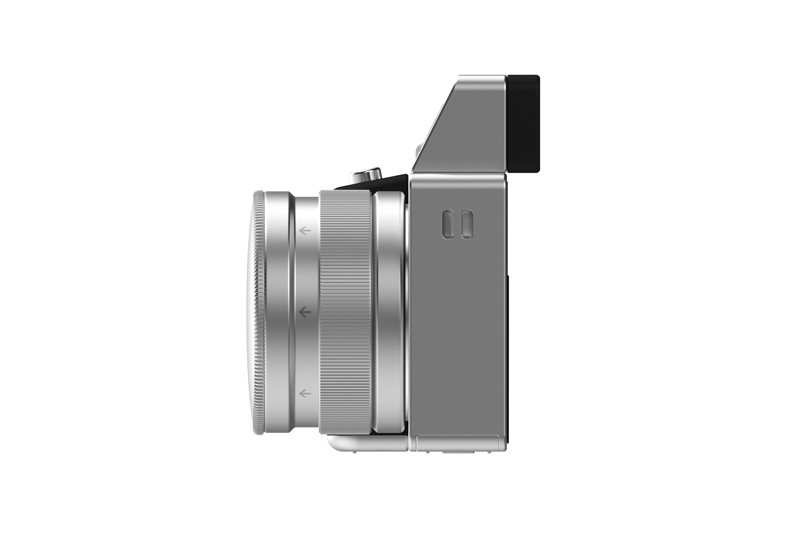

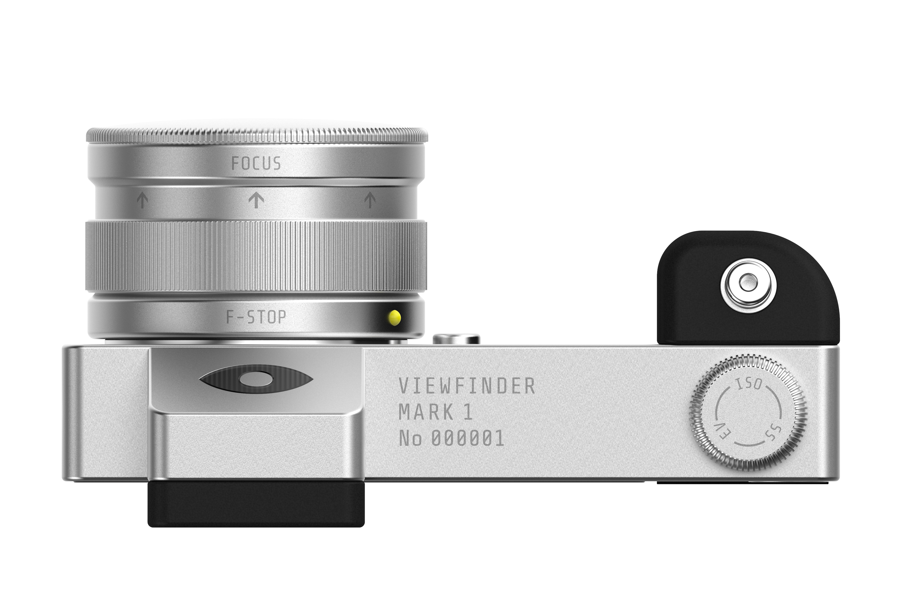

    

        One of the unique things about this camera is it's control dial. Cameras today have multiple dials for seperate functions, like for controlling the ISO, or Shutter Speed, or the Exposure compensation values. The problem with this approach is as you're taking a photo you need to be constantly playing with each of these dials, requiring a user to remember locations while positioning a shot. Viewfinder takes a simpler approach, with one dial that can toggle between each of these functions with a push.
    

<!-- 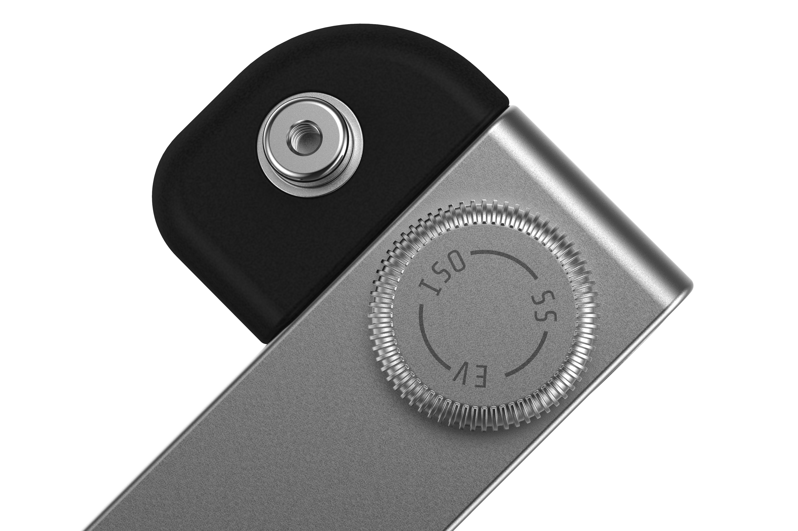

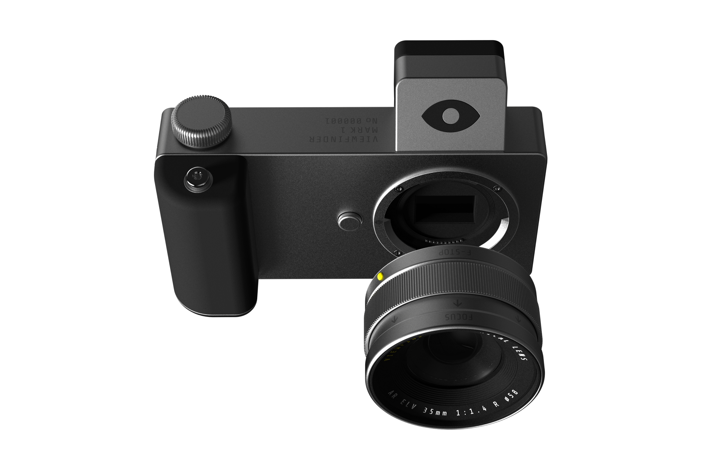

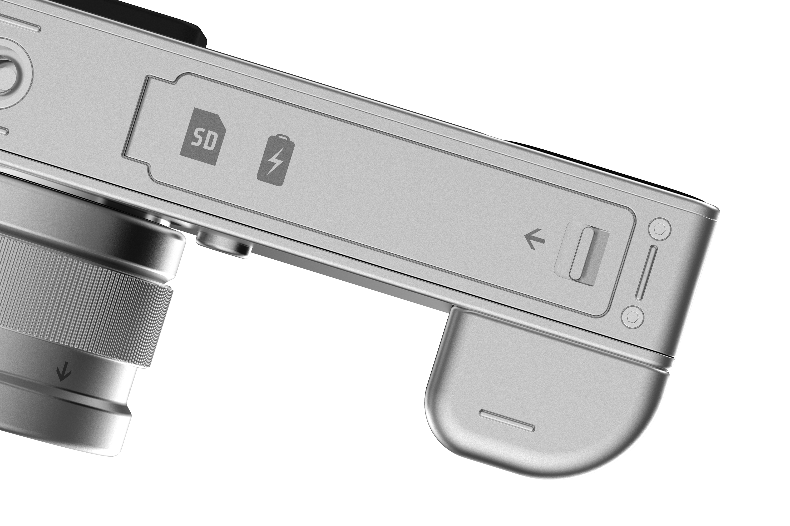

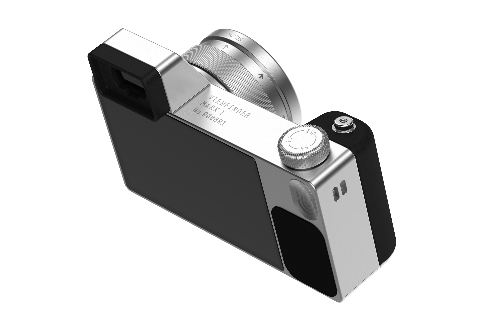

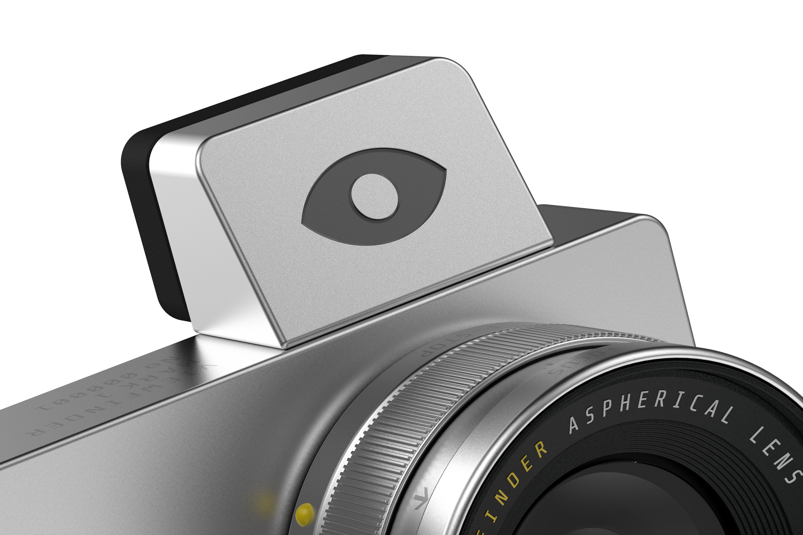 -->

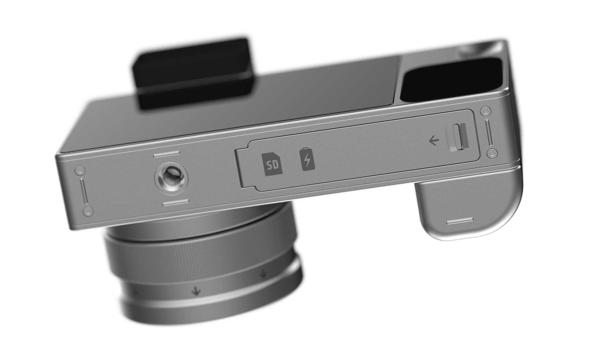

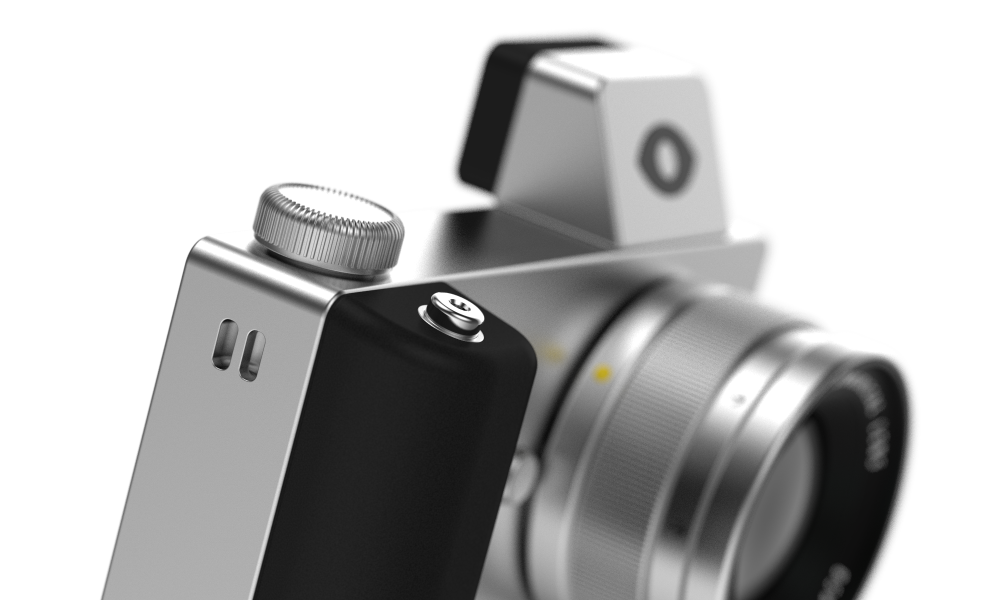

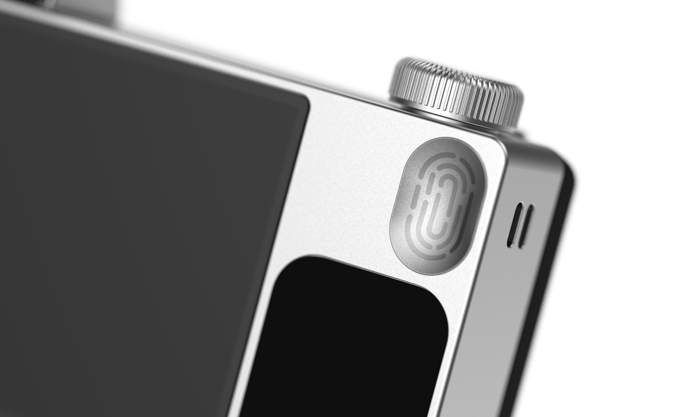

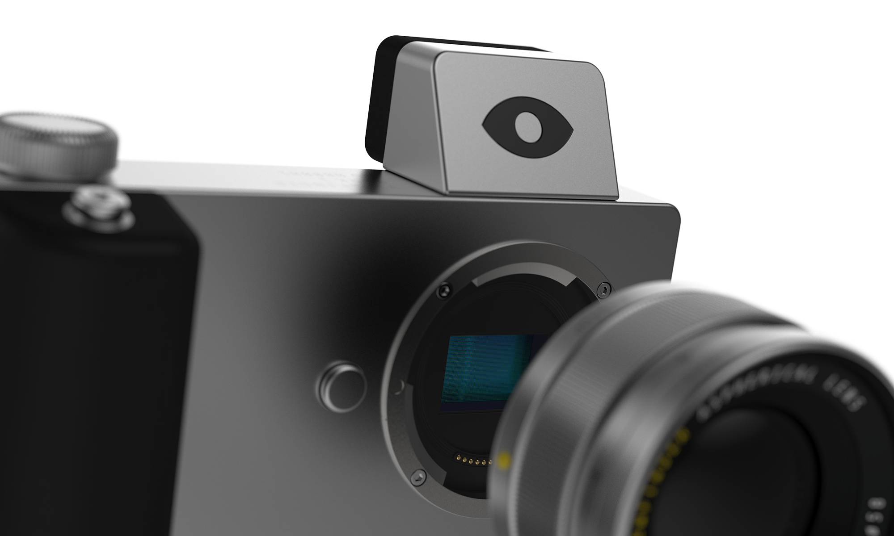

    

        With this project I took the opportunity to envision how the UI and hardware could be seamlessly brought together to deliver a more holistic package. 
    

